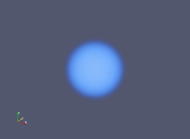
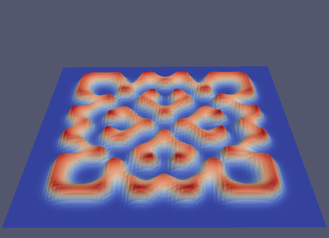
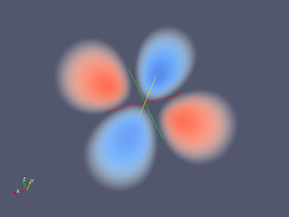
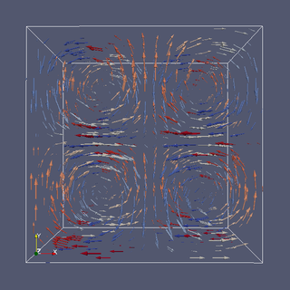
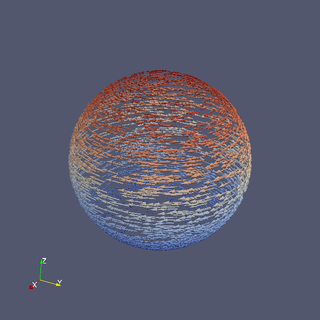

# Samples for ParaView

This is a collection of samples to create data files with Python or Ruby and visualize them with ParaView.

## [simple](simple)

A simple volume rendering.

## [gray-scott](gray-scott)

A sample of 2-D Visualization with Delaunay 2D and Warp by Scalar filters.

## [wavefunction](wavefunction)

A sample of volume rendering of wave functions.

## [glyph](glyph)

A sample using the glyph filter.

## [Unstructured Grid](unstructured)

A sample of Unsgructured Grid.

## [makej](makej)

A sample of using `make -j`.

# License

This software is released under the MIT License, see [LICENSE](LICENSE).
