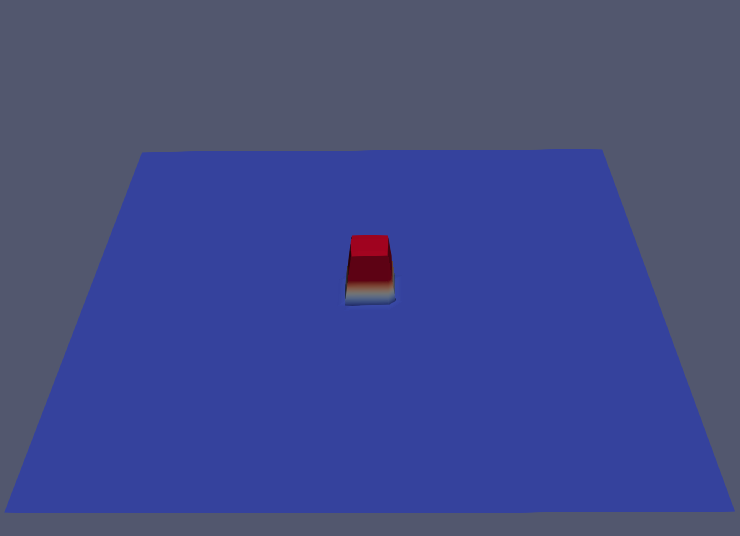
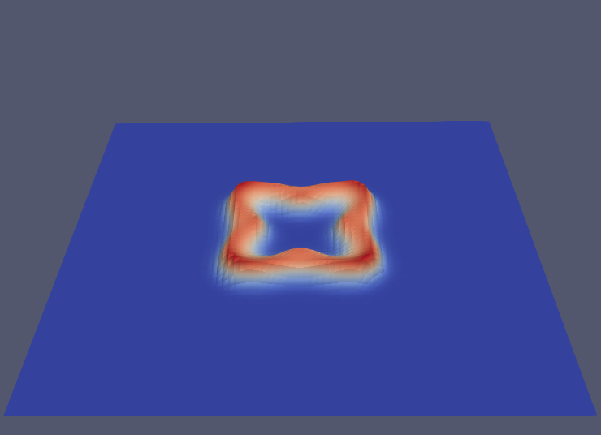
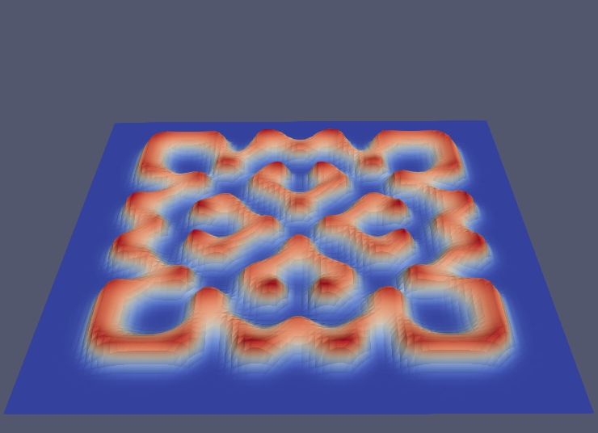

# Gray-Scott model

## Summary
An example of 2-D visualization on ParaView.

## Usage

``` 
$ make
$ ./gs
``` 

## Visualization

1. Open file conf..vtk in ParaView, and Apply
2. Move to Last Frame, Rescale to Data Range in Display at Object Inspector
3. Apply filter - Delaunay 2D
4. Apply filter - Warp by Scalar with Scale Factor 10
5. Save Animation will give you the following images.






## Governing Equation

The Governing equation is the following Gray-Scott model.


Parameters: L=80*80; F=0.04; k = 0.06075; Du = 0.05; Dv = 0.1; dt = 0.2; 1frame/100steps; 150 frames; Total 15000 steps. 
