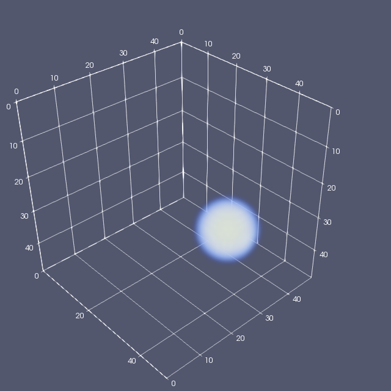
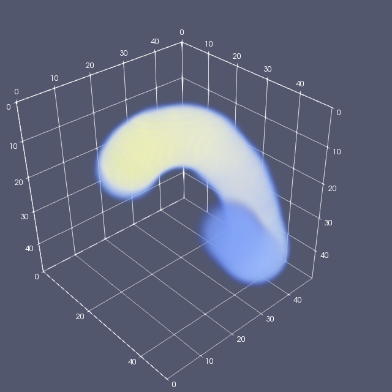
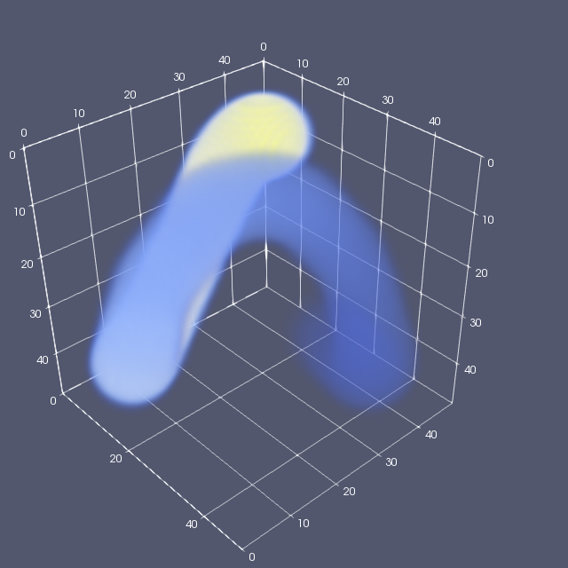
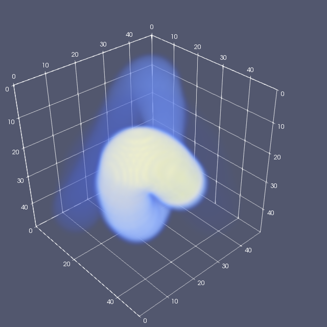

# Makefileで簡易並列データ処理

[English](README.md)/Japanese

[Qiita](https://qiita.com/kaityo256/items/c147679157d9d3fe036e)からの転載。

## はじめに

一定ステップごとにデータを吐いておいて、後で変換したいことがよくある。本稿では、大量に吐かれたデータをMakefileで簡単に並列処理する方法を紹介する。

## Makefileの書き方

あるプログラムを実行すると、データファイルがdata000.dat, data001.dat・・・と連番で出力されるとしよう。このファイルを処理して別の拡張子のデータファイルに変換することを考える。たとえば、可視化のためにParaViewに食わせるためのVTKファイルに変換したいとしよう。そのためにデータファイル(.dat)を食わすと標準出力にVTKファイル(.vtk)ファイルを吐くスクリプト`dat2vtk.rb`を作り、

```sh
ruby dat2vtk.rb data000.dat > data000.vtk
```

などと使うことを考える。シェルスクリプトに慣れた人なら

```sh
for file in *.dat; do ruby dat2vtk.rb $file > ${file/dat/vtk} ;done
```

とか書きたくなるかもしれないが、これだとシリアルにしか処理されないし、プログラムの実行中に、確認のため途中まで処理した場合でも、また全部最初から処理されてしまう。

そこで、Makefileの機能を使って一気に処理する。書くべき内容はこれだけ。

```mf:makefile
DAT=$(shell ls *.dat)
VTK=$(DAT:.dat=.vtk)

.SUFFIXES: .vtk .dat

all:$(VTK)

.dat.vtk:
  ruby dat2vtk.rb $< > $@
```

以下、一行ずつ何をやってるかの説明。

1. 変換元ファイルの一覧を取得：`$(shell hoge)`は、シェルコマンド`hoge`を実行した結果を変数に入れる。ここではカレントディレクトリにある`dat`ファイル一覧が`$(DAT)`に入る
2. 変換後ファイルの一覧を作成：Makefileでは、変数に入ったファイル一覧の拡張子を変換する機能がある。ここでは`$(DAT:.dat=.vtk)`として、.datファイルの拡張子を.vtkに変換したファイル名一覧を作成している
3. 拡張子ルールのための設定：`.SUFFIXES: .vtk .dat`により、Makefileに.vtkや.datが拡張子であることを教えている。
4. 目的ファイルの設定：`all:$(VTK)`により、カレントディレクトリにある.datファイルの拡張子を.vtkに変換したものすべてを作りたいことをMakefileに教える
5. 拡張子ルール：`.dat.vtk:`は、.datから.vtkを作る方法の指定。`$<`は変換元ファイル、`$@`は変換後ファイル名に展開されるマクロ。

後は、.datファイルがカレントディレクトリにある状態で

```sh
make -j 4
```

とかやれば、4並列で一気にファイルが変換されていく。前回、途中まで変換していた場合や、一部だけ.datファイルが変更された場合は、更新されたファイルのみ変換してくれる(Makefile使ってるから当たり前だが)。

## 例

例として、double型のスカラー値をだらだら保存した.datファイルを作成し、それを読み込んで.vtkファイルにするスクリプトを作ってみる。

まず、.datを作るコード。何かシミュレーションして、空間をグリッドに切って、それぞれのセルの物理量をdoubleで保存する、といったことを想定し、50×50×50のdoubleデータを連番ファイルで保存するスクリプトを用意してみた。こんな感じ。

```rb
$grid = 50

def save_dat(filename,data)
  s = data.pack("d*")
  puts filename
  open(filename,"wb") do |f|
    f.write s
  end
end

def pos2index(x,y,z)
  ix = x.to_i
  iy = y.to_i
  iz = z.to_i
  ix + iy * $grid + iz * $grid**2
end

def put_ball(x,y,z,data)
  r = 8
  (-r..r).each do |ix|
    (-r..r).each do |iy|
      (-r..r).each do |iz|
        i = pos2index(x+ix,y+iy,z+iz)
        v = 1.0 - (ix**2 + iy**2+iz**2).to_f/(r**2)
        next if v < 0.0
        data[i] = data[i] + v
        data[i] = 1.0 if data[i] > 1.0
      end
    end
  end
end

def makedat
  r = $grid/2 - 8
  steps = 100
  data = Array.new($grid**3){0}
  steps.times do |i|
    filename = sprintf("data%03d.dat",i)
    s = 2.0*Math::PI*i/steps
    x = $grid/2 + r*Math.cos(s)
    y = $grid/2 + r*Math.sin(3.0*s)
    z = $grid/2 + r*Math.sin(2.0*s)
    put_ball(x,y,z,data)
    save_dat(filename,data)
    data.map!{|v| v*0.95}
  end
end

makedat
```

これを

```sh
ruby makedat.rb
```

として実行すると、`data000.dat`から`data099.dat`までの連番ファイルができる。このdatファイルを読み込んで、VTKフォーマットとして標準出力に出力するスクリプトがこんな感じ。

```rb
if ARGV.size < 1
  puts "usage: dat2vtk.dat filename.dat"
  exit
end

datfile = ARGV[0]
data = File.binread(datfile).unpack("d*")
grid = 50
points = grid**3

puts <<"EOS"
# vtk DataFile Version 1.0"
#{datfile}
ASCII
DATASET STRUCTURED_POINTS
DIMENSIONS #{grid} #{grid} #{grid}
ORIGIN 0.0 0.0 0.0
SPACING 1.0 1.0 1.0
POINT_DATA #{points}
SCALARS scalars float
LOOKUP_TABLE default
EOS
data.each do |v|
  puts v
end
```

これを、先ほどのMakefileで処理する。

```makefile
DAT=$(shell ls *.dat)
VTK=$(DAT:.dat=.vtk)

.SUFFIXES: .vtk .dat

all:$(VTK)

.dat.vtk:
  ruby dat2vtk.rb $< > $@

clean:
  rm -f *.vtk *.dat
```

一応make cleanも作ってみた。これでたとえば`make -j 4`とかすれば、4並列でデータが処理される。できたvtkファイルをParaViewで読み込んで適当なカラースケールでVolumeレンダリングすると、こんな絵になる。






アニメーションGIFにすると楽しい。

## まとめ

Makefileのルールを使って、ある拡張子のデータを別の拡張子に変換する作業を並列化してみた。シミュレーションをしているとこういう状況は良くあるので、知ってるとわりと便利だと思う。最近の石はコアがいっぱいあるので、コアの数か、その倍だけ`make -j`するとわりと幸せになれるかもしれない。ちなみに、ローカルPCでは何やってもいいけれど、研究室のクラスタやスパコンのログインノードとかでこれをやると他のユーザの迷惑になるので、やるならインタラクティブジョブでやってくださいまし。