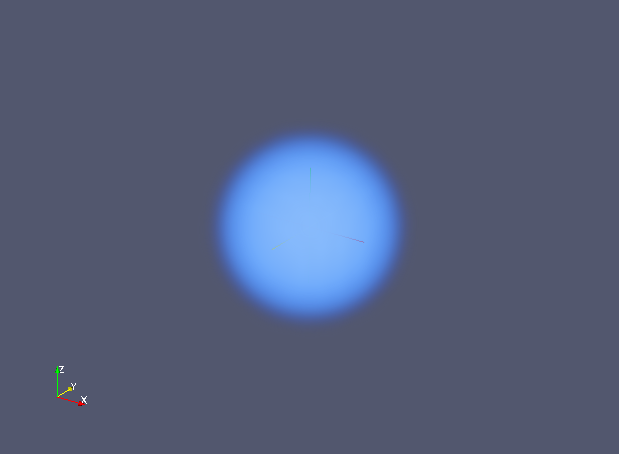

# Simple Example

## Summary
An example of 3-D visualization on ParaView.

## Usage

```sh
ruby simple.rb
```

or

```sh
python simple.py
```

Then you will obtain `simple.vtk`.

## Visualization

1. Open file sample.vtk in ParaView, and Apply
2. Choose Volume
3. Change Color Scale (refer the following image)


4. It gives you the following image.


