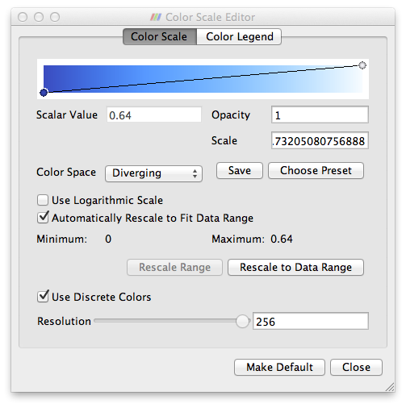

# Simple Example

## Summary
An example of 3-D visualization on ParaView.

## Usage

``` 
$ ruby simple.rb > simple.vtk
``` 

## Visualization

1. Open file sample.vtk in ParaView, and Apply
2. Choose Volume
3. Change Color Scale (refer the following image)



4. It gives you the following image.


