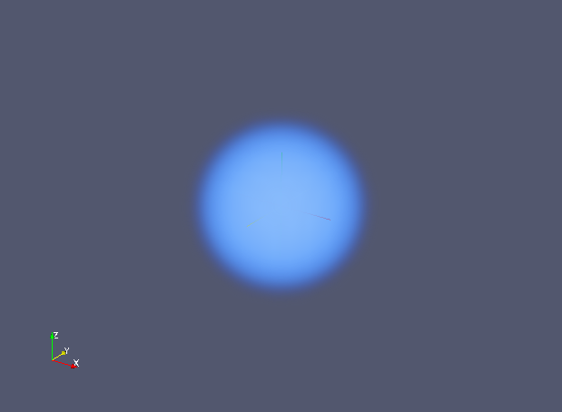

# Simple Example

## Usage

``` 
$ ruby sample.rb > sample.vtk
``` 

## Visualization

1. Open file sample.vtk in ParaView, and Apply
2. Choose Volume
3. Change Color Scale (refer the following image)

4. It gives you the following image.

