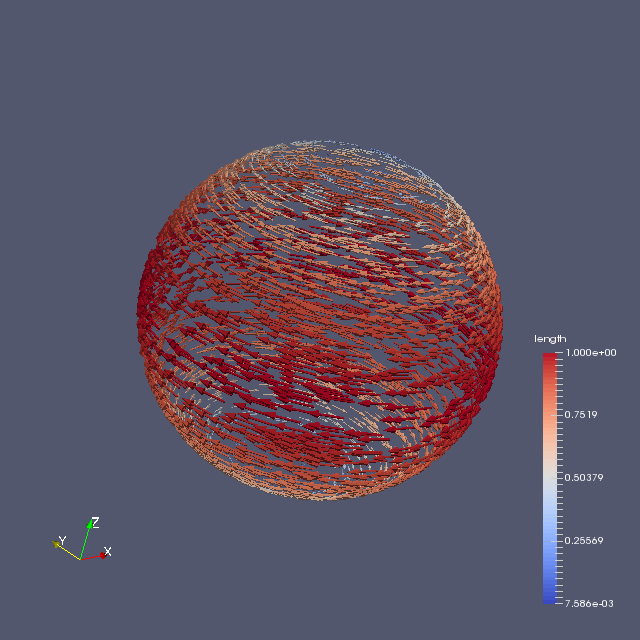

# Unstructured Grid Example

## Summary
An example of Unstructured Grid on ParaView.

## Usage

```
$ ruby sphere.rb > sphere.vtk
```

## Visualization

1. Open file sphere.vtk in ParaView, and Apply Glyph
2. Choose scalar in Scale Mode  and Apply
3. It gives you the following image.


