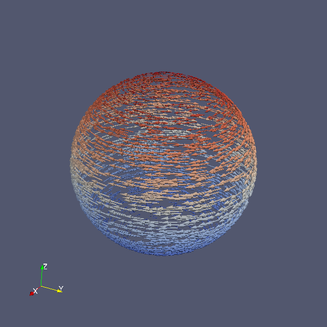

# Unstructured Grid Example

## Summary
An example of Unstructured Grid on ParaView.

## Usage

```
$ ruby sphere.rb > sphere.vtk
```

## Visualization

1. Open file sphere.vtk in ParaView, and Apply Glyph
2. Choose vector in Scale Mode and Apply
3. Then you will obtain the following image.


