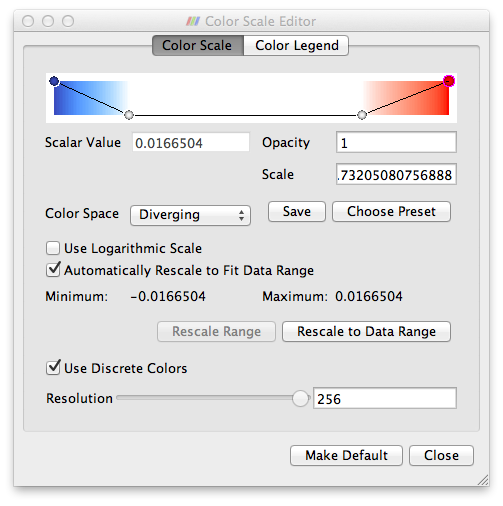
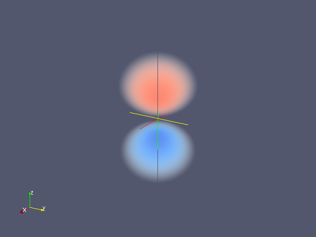
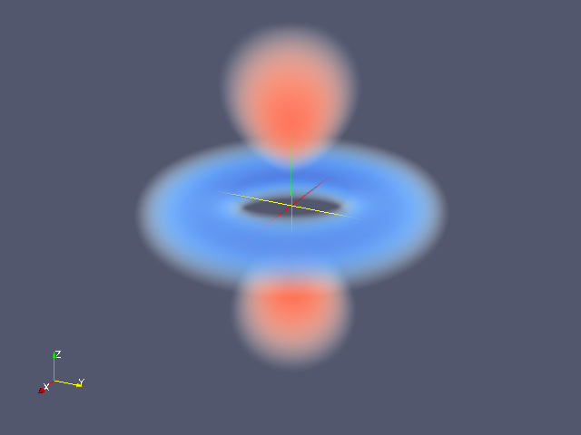
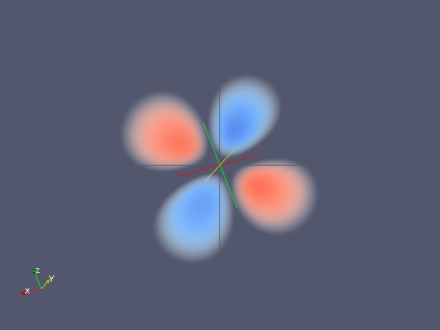

# Wave Function

## Summary
An example of 3-D visualization on ParaView.

## Usage

```
$ ruby wavefunction.rb
```

## Visualization

1. Open file 2pz.vtk in ParaView, and Apply
2. Choose Volume (default is Outline)
3. "Rescale to Data Range" in Display at Object Inspector
4. Open Color Map Editor and choose color map. Here is a sample of color map for 2pz.vtk



## Samples of Visualization

"Save Screenshot" in File menu gives you the following pictures.

2pz



3dz2



3dzx


